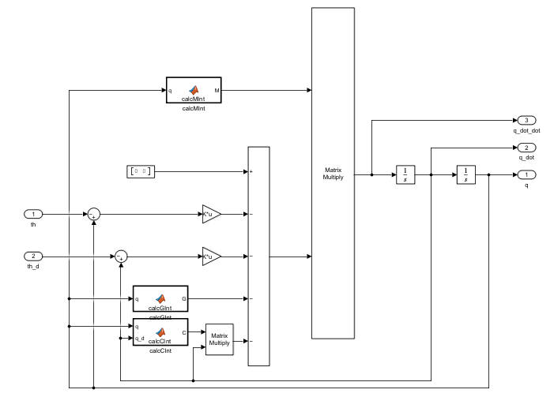
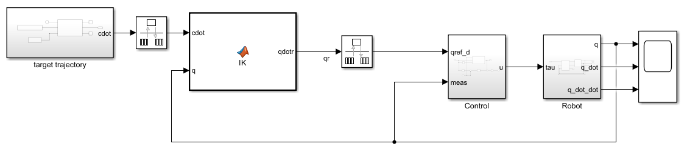

# Modelling and Control Robot Manipulator
## Dynamic Modelling
Creating a mathematical model for a 2R robotic arm (with two rotating joints) involves a few key steps. Here's a simpler explanation of the process:
- **Recognize the Robot's Design:** Start by determining the robot arm's actual physical configuration. Be aware of the joint locations and lengths of each component. To begin modeling, you must have this basic information.
- **Calculate the Arm's Movements:** Apply a technique (such as the Denavit-Hartenberg convention) to derive equations illustrating how alterations in joint angles affect the position and angle of the arm's extremity.
- **Connect Movements and Veloces:** Locate a unique matrix known as the Jacobian matrix. This makes it easier to comprehend how variations in joint speed impact the arm's end's velocity and direction.
- **Motion and Speed Equations:** Utilizing the movement equations from step 2, use calculus to establish a connection between the joint and arm-end speeds.
- **Include Energy Formulas:** Put the Lagrangian equation in writing. This integrates the energy for each arm component derived from movement (kinetic energy) and location (potential energy).
- **Utilize the Lagrange Equations:** Apply Lagrange's formulas to the step five Lagrangian. In order to demonstrate how the robot arm responds to forces, gravity, and its own weight, this stage generates dynamic equations.
- **Resolve the Equations of Movement:** Solve these dynamic equations to have a complete understanding of the arm movements. Usually, this results in intricate equations that require simultaneous solution.
- **Simplify Assumptions:** Because the equations can be rather complex, they are frequently reduced in complexity or simplified to resemble a straight line in order to make them easier to understand. This could entail overlooking insignificant impacts or assuming particular things about how the arm functions in particular circumstances.
Its mass distribution, geometry, joint configurations, and external forces or torques influence a manipulator's dynamics. The dynamic equation can be represented as:

$$
M(q) \ddot{q}+C(q, \dot{q}) \dot{q}+\tau_g(q)=\tau
$$

The dynamic modeling equation for the required manipulator is given below:
$$
\begin{gathered}
M(q) \ddot{q}+C(q, \dot{q}) \dot{q}+D_l(\dot{q}-\dot{\theta})+k(q-\theta)+\tau_g(q)=\mathbf{0} \\

J \ddot{\theta}+D_{m}(\dot{q}-\dot{\theta})+k(q-\theta)=\tau_{m}
\end{gathered}
$$

where,
- $M(q)$ represents the mass or inertia matrix
- $C(q,\dot{q})$ represents the Coriolis and centrifugal effects
- $D$ represents the damping effect
- $k(q-\theta)$ represents the nonlinear stiffness effect 
- $\tau_g(q)$ represents the vector of joint torques or forces
- $J$ represents the inertia of the motor
- $\tau_m$ represents the torque of the motor

The matrices required to solve the general equation are the following:
$$
\begin{gathered}
M(q)=\left[\begin{array}{cc}(m 1+m 2) l 1^2+m 2 l 2^2+2 m 2 l 1 l 2 \cos (q 2) & m 2 l 2^2+m 2 l 1 l 2 \cos (q 2) \\ m 2 l 2^2+m 2 l 1 l 2 \cos (q 2) & m 2 l 2^2\end{array}\right] \\

C(q, \dot{q})=\left[\begin{array}{cc}-2 l 1 l 2 m 2 \sin (q 2) q 2^{\circ} & -l 1 l 2 m 2 \sin (q 2) q 2 \\ l 1 l 2 m 2 \sin (q 2) q 2^{\cdot} & 0\end{array}\right] \\

\tau_g(q)=\left[\begin{array}{c}(m 1+m 2) g l 1 \sin (q 1)+m 2 g l 2 \sin (q 1+q 2) \\ m 2 g l 2 \sin (q 1+q 2)\end{array}\right] \\

K=\left[\begin{array}{cc}k 1 & 0 \\ 0 & k 2\end{array}\right] \\

D_l=\left[\begin{array}{cc}D_1^l & 0 \\ 0 & D_2^l\end{array}\right] \\

D_m=\left[\begin{array}{cc}D_1^m & 0 \\ 0 & D_2^m\end{array}\right] \\

J=\left[\begin{array}{cc}I_1 & 0 \\ 0 & I_2\end{array}\right]
\end{gathered}
$$

Where the values of the constant terms are:

| Description | Symbol | Value | Unit |
| ----------- | ------ | ----- | ---- |
| Link Mass | m1 | 1 | Kg |
| | m2 | 1 |
| Link Length | l1 | 0.4 | M |
| | l2 | 0.4 |
| Link Damping | D1l | 0.3 | Nms/rad |
| | D2l | 0.3 |
| Motor Inertia | J1 | 0.1 | Nms2/rad |
| | J2 | 0.1 |
| Motor Damping | D1m | 0.2 | Nms/rad |
| | D2m | 0.2 |
| Spring Stiffness | k1 | 10 | Nm/rad |
| | k2 | 10 |
| Gravitational Acceleration | g | 9.81 | ms-2 |

## Control System Design
Combining PID controllers and feedforward dynamic models is a clever technique to manage machines or systems in control system design. The goal is to improve the functionality of these systems by incorporating a prediction component. As intelligent tuning tools, PID controllers respond more effectively thanks to this predictive component. This combination helps the system remain resilient and adaptable so that it can continue to function effectively.
### Feedforward Dynamic Model
For control systems, the feedforward dynamic model functions as a kind of prophecy tool. It's a collection of mathematical formulas that predict how modifications to the system will impact the result. Because it takes into account intricate details like friction and the effort required to move objects (inertia), it is incredibly intelligent. The system is constructed according to the physical laws it adheres to. The feedforward model becomes more valuable with the addition of these intricate details, particularly in systems with complex behavior. This is how the math formula looks:
$$
M(q) \ddot{q}+C(q, \dot{q}) \dot{q}+D(\dot{q}-\dot{\theta})+\tau_g(q)=\mathbf{0}
$$
### PID Controllers
An integral component of the control system are PID (proportional, integral, and derivative) controllers. They operate by continuously changing the input for control in accordance with three distinct terms:
- **Proportional (P):** This component modifies the control in response to the present error, which is the discrepancy between the desired and actual outcomes. It works to lessen this mistake.
- **Integral (I):** This section adds up previous errors over time to assist correct persistent, long-term errors. It attempts to get rid of recurring discrepancies between the intended and real results.
- **Derivative (D):** This section forecasts future errors by examining how quickly the error is changing. Like a stabilizer, it aids in preventing the system from moving too far in either direction. The PID mathematical model looks like this:
$$
u=k_p \cdot e(t)+k_i \cdot \int e(t)+k_d \cdot \dot{e}(t)
$$

### Integration of Feedforward and PID
A well-rounded control system is produced by combining PID controllers with the feedforward dynamic model. By anticipating input reactions, the feedforward component aids in the system's adaptation to changes. PID controllers, on the other hand, continuously adjust inputs based on present mistakes in order to respond swiftly to any deviations from the intended course.
Benefits of Feedforward Dynamic Model-Based PID Control
- **Faster Response:** The system can react to changes more quickly thanks to the feedforward model's predictive power, which also shortens the time it takes to fix problems.
- **Improved Stability:** PID controllers modify inputs in response to faults, which helps to maintain stability. The feedforward model's predictions are included, making the system more controllable and stable.
- **Managing complicated Situations:** A feedforward model that takes nonlinear behaviors into account makes the system more adept at managing complicated dynamics.
### Implementation
It is crucial to adjust the PID controller's parameters and confirm the accuracy of the feedforward model when configuring this. This process of fine-tuning guarantees the system performs optimally in various scenarios.
## MATLAB/Simulink Simulation Environment

## Conclusion
In this study, I explored the design and control of a robotic system with particular attention to joint space and Cartesian space control techniques. I worked hard to construct the dynamic model of the robot with state space representations and matrices. Our control system had a solid base because of this. For joint space control, I used a feedforward system with a PID approach, and for Cartesian space control, I used inverse kinematics.

The dynamic model—which was modeled using matrices and state space equations—was essential to comprehending the behavior of the robot. I were able to understand the dynamics of the system by using these matrices to help us capture the intricate relationships between the joint variables. The robot followed the intended pathways thanks to the joint space controller's ability to precisely coordinate joint movements when used in conjunction with the PID approach. Control was made intuitive by directly defining the robot's end position through the use of inverse kinematics in the Cartesian space controller.

Key performance metrics such overshoot, settling time, and steady-state error were used to assess the controllers. The combined space and Cartesian space controllers both performed admirably, which was encouraging. They demonstrated their capacity to precisely and reliably manage the robot by producing outputs with low steady-state error, slight overshooting, and quick settling times. I also conducted simulations to assess the robustness of the system and see how it would function in various physical scenarios. The controllers worked flawlessly even after I doubled the weight and length of the robot's second arm. They demonstrated their ability to adjust to variations in the dynamics of the robot while preserving low overshoot, fast settling times, and 0% steady-state error.

All things considered, our proposed control system demonstrated its flexibility and dependability in both routine and difficult situations. Our robotic system is flexible and resilient, suitable for a variety of applications thanks to its joint space and Cartesian space control methods, as well as its efficient application of inverse kinematics and PID controllers.
